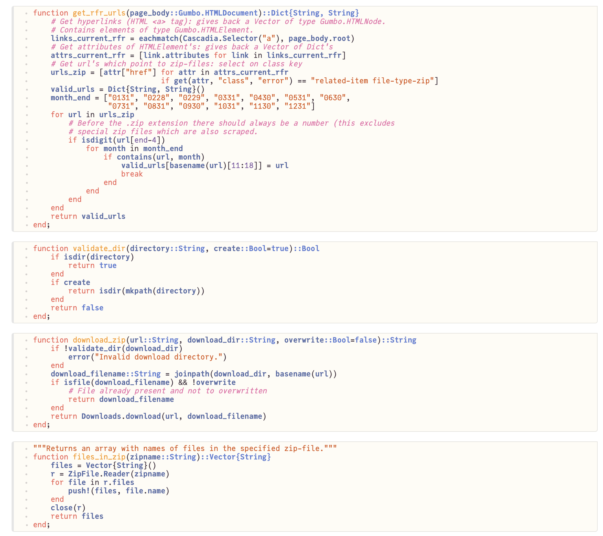

# eiopa_rfr_scraper

I recently started learning Julia (coming from Python) and during this process I took one of my Python (Jupyter) notebooks and converted it to a Pluto notebook: the results can be found here. Pluto is a very interesting notebook implementation aimed specifically at Julia. Really great stuff, check out <a href="https://github.com/fonsp/Pluto.jl" target="_blank">Pluto</a> on GitHub (and also <a href="https://github.com/fonsp/PlutoUI.jl" target="_blank">PlutoUI</a>, for using UI widgets in a Pluto notebook).

Ok, so what am I trying to achieve here (details can be read below in the screenshots section)?

- Scrape specific links pointing to zip-files from several webpages.
- Download the zip-files (all at once or specific ones).
- Extract specific Excel files from the downloaded zip-files.
- Read a specific cell range from a specific worksheet in an extracted Excel file.
- Plot the results (in this case interest rates versus time).

All the steps above present interesting challenges when learning a new language and getting to know its possibilities and quirks. Julia certainly lived up to this challenge: easy to use, lots of available packages, fast development. Love it.

By the way, speaking of Julia: have a look at the excellent series of lectures
from the course <a href="https://computationalthinking.mit.edu/Spring21/" target="_blank">Introduction to Computational Thinking</a>. Highly recommended, great way to take a deep dive into the language.

Below are some screenshots of the way the notebook turned out, the notebook itself can be found in the *notebooks* directory.

